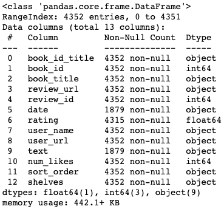
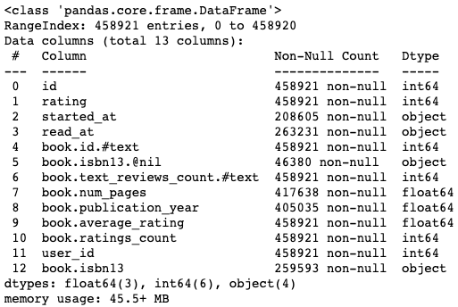

## Data

#### Target Reviews: 3,090 obs
Goodreads only displays 300 reviews, but I was able to go around this with filters to scrape 4352 reviews of the target book. Only 3090 of these reviewers had public profiles.

#### Reviewers' Reading History - 458,921 obs
For each reviewer of the target book, I scraped the data on their last 200 reads. In this df there are both reader-book and book data.

#### Books' Genres - 161,572 obs
I scraped the genres of the books included in the reviewers' histories to I can aggregate at the reader-genre level.

