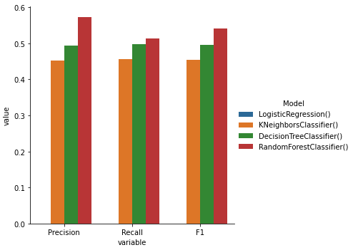
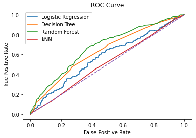

## Classification Project MVP
The goal of this project is to create a classification project to predict whether readers will like a specific [book](https://www.goodreads.com/book/show/1162022.On_the_Jellicoe_Road) based on their Goodreads reading history.

#### Data
- Target - 3,090 obs - Goodreads only displays 300 reviews, but I was able to get around this though filters, to collect 4352 reviews. Of these reviewers, only 3090 have public profiles.
- Features: Not everyone has read the exact same books, so I will engineer my features at the reader and reader-genre level.
1. Reviewer history - 458,921 obs -  For each reviewer of the target book, I scraped the data on their last 200 reads so I can aggregate at the user level.
2. Books in reviewers' histories - 161,572 obs - I scraped data from the books included in the reviewers' histories to I can aggregate at the reader-genre level.

#### Preliminary Feature Engineering
I engineered 6 features at the reader level:
- Avg publication year of books read.
- Avg rating they give to books read
- Avg rating bias (their rating compared to books' avg rating)
- Avg length of books read
- Avg \# ratings in books read (measure of book popularity)
#### Performance
I engineered 6 features at the reader level and compared their test data prediction performance in 4 classification models without hyperparameter tuning.

The Random Forest Classifier had the best performance across the board, while the Logistic Regression model had 0 accuracy.
While this may be in part due to a slight imbalance in the dataset, and improves as we adjust the cutoff, it implies that the feature-target relationship is not linear.
In the ROC Curve we can appreciate how the models have better performance than a naive, random guess model at different thresholds.

#### Next Iterations
I believe I can improve model performace by engineering features at the reader-genre level, dealing with the slight class imbalance, regularization, and other hyperparameter tuning. While doing this, I should balance complexity, and avoid overfitting to my test set with techniques like cross-validation and pruning (for tree-based models, which seem to be the best suited for this problem).
